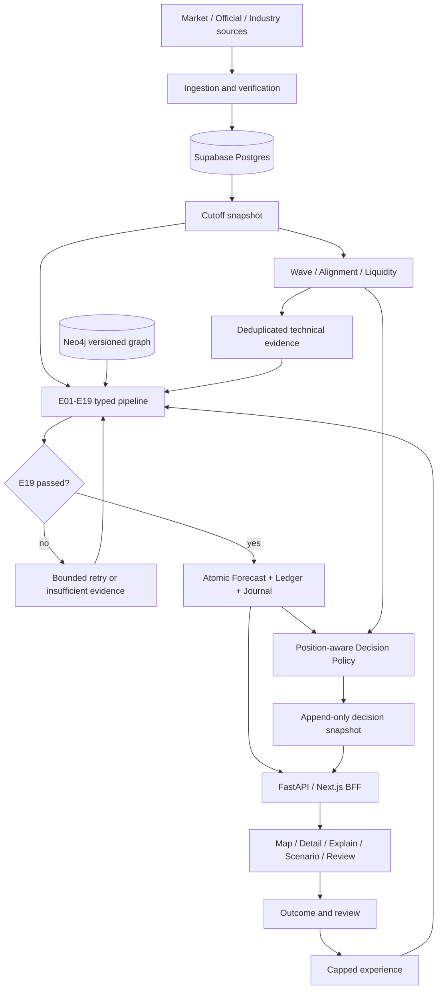

# SEC Future Reasoning v1.1 — 통합 Design

> Version 1.0.0 · 2026-09-09 · bkit Enterprise · 상태: 설계 완료, 구현 전
> Feature: `sec-future-reasoning-v1-1`

## 1. 기준과 문서 구성

[Canonical PRD](../../samsung_preferred_future_reasoning_prd_v1.1.html)와 [Plan 1.1](../../01-plan/features/sec-future-reasoning-v1-1.plan.md)을 따른다. [상세 PRD](../../samsung_future_reasoning_prd_v1.1.html)의 화면/API/T01–T70/MT01–MT10은 보완 명세다. 충돌 시 canonical 및 AGENTS를 우선한다. 첫 구현 목표는 검증 가능한 실제 수집 배치가 전체 처리 경로를 통과하는 End-to-End Vertical Slice다.

상세 계약은 [Engine·추론 모델](sec-future-reasoning-v1-1/engines-and-model.md), [49 Factor Registry](sec-future-reasoning-v1-1/factor-registry.md), [Golden 테스트 카탈로그](sec-future-reasoning-v1-1/golden-cases.md)에 정의한다. 부록도 이 Design의 일부다.

Design 완료는 구조와 구현 기준의 확정을 뜻한다. 알고리즘의 실전 성능, 실제 공급자 접근권, 외부 DB/배포 검증 완료를 뜻하지 않는다. 본문의 수치 중 PRD에 없는 것은 `experimental-v1` 설계 가정이며 변경 전에 테스트와 버전을 갱신한다.

## 2. 아키텍처



### 2.1 실행 단위와 의존성

| 구성 | 책임 | 금지 의존성 |
|---|---|---|
| `apps/web` | Next.js App Router, 한국어 UI, BFF, 사용자 세션 | Neo4j/service-role/LLM secret의 브라우저 전송 |
| `apps/reasoning_api` | FastAPI, 요청 검증·인증, read model, job 제출 | HTTP 요청 안에서 긴 simulation 완료 대기 |
| `reasoning/orchestrator` | LangGraph state/checkpoint, run lifecycle, routing | API/UI 데이터 형식에 종속된 도메인 규칙 |
| `reasoning/engines` | E01–E19 typed I/O 변환 | 다른 Engine 내부 함수 호출, decision threshold 읽기 |
| `reasoning/services` | LLM/quant/graph/simulation/rule/experience port | 공급자 응답을 검증 없이 artifact로 전달 |
| `reasoning/decision` | Position·gate별 action/reason | Forecast probability 수정 |
| `ingestion` | 공급자 adapter·validation·revision·outbox | observation UPDATE로 과거 값 덮어쓰기 |
| `graph`, `db/supabase` | migration·graph manifest·immutable storage | 현재 graph를 과거 버전으로 가장하기 |

Python 모듈/함수는 snake_case, 클래스는 PascalCase, 상수는 UPPER_SNAKE_CASE다. 웹 파일은 kebab-case, 컴포넌트 PascalCase, TS 함수 camelCase로 프로젝트 관례를 적용한다. JSON은 snake_case로 통일한다. Python schema에서 JSON Schema를 생성하고 TS 타입을 생성해 이중 수기 정의를 피한다.

### 2.2 런타임 기준

설계 목표는 Python 3.12, Pydantic 2 계열/FastAPI, LangGraph 1 계열, Node.js 22, Next.js 16 계열이다. 이는 호환성 검증 완료 선언이 아니다. P1에서 설치 가능한 패치 버전을 해석해 Python lockfile·npm lockfile에 고정하고 contract/build smoke check를 수행한다. Neo4j 이미지/driver 및 Postgres 버전은 실제 Supabase 환경과 일치하는 조합으로 P2에서 고정한다. floating latest를 CI에서 사용하지 않는다.

Next.js 설치 요건은 [공식 설치 문서](https://nextjs.org/docs/app/getting-started/installation)를 확인했다. LangGraph checkpoint를 사용하되 도메인 저장의 idempotency는 별도 보장한다. [LangGraph persistence](https://docs.langchain.com/oss/python/langgraph/persistence).

## 3. 공통 계약과 시간 모델

### 3.1 값과 식별자

- `Horizon = 1d | 1w | 1m | 3m | 1y`, `Timeframe = 30m | 1d | 1w | 1mo`.
- Horizon end는 cutoff 이후 KRX 거래 세션 1/5/21/63/252번째 종가로 계산하는 초기 실험 규약이다. 매 Run에 실제 `target_at` 및 `calendar_version`을 저장한다. 중간 변경 시 과거 target을 다시 계산하지 않는다.
- 가격은 KRW decimal, 비율은 [0,1], 표시용 %p는 내부 확률 차이×100. NaN/Infinity, timezone 없는 timestamp, 정의 없는 단위를 거절한다.
- UUID는 Run/artifact/observation ID, 안정된 slug는 Factor/Module ID다. 모든 artifact에 `schema_version`, `artifact_type`, `artifact_id`, `run_id`, `engine_id/version`, `created_at`, `data_cutoff`, `input_artifact_ids`, `evidence_refs`, `payload_hash`를 포함한다.
- `VersionBundle`: ontology, graph, model, prompt, calibration, policy, engine-version map, source-registry, calendar, code commit. Fixture의 미학습 모델은 반드시 `experimental` provenance를 갖는다.

### 3.2 Run과 EngineResult

`ReasoningState`는 RunContext, immutable input manifest, typed artifact refs, Horizon별 결과 refs, attempt counters, feedback hash, dependency generation을 보유한다. 본문 텍스트를 상태 간 명령으로 사용하지 않는다.

`EngineResult[T] = {status, output_artifact: T|null, confidence: number|null, evidence_refs, warnings: Warning[], next_engine, retry_engine, trace_id}`. status는 success/insufficient_evidence/conflict/retry/failed다. success는 output과 근거를 필수로 하며, 도메인적으로 해당 없는 정상 결과는 typed `applicable:false`와 사유로 표현한다. 실패에서 confidence를 0.5로 채우지 않는다. Warning은 `{code, severity, evidence_refs, message}`이며 message는 표시용이다.

`RunStatus = queued | running | retrying | insufficient_evidence | conflict | failed | completed`. completed는 E19 통과 및 발행 transaction commit 후에만 설정한다. 부족한 evidence로 끝난 Run은 진단 journal을 남길 수 있지만 유효한 Forecast ID를 만들지 않는다.

### 3.3 시점과 정정

Observation은 `observed_at`(경제적 시각), `published_at`(공급자 공개 시각), `available_at`(시스템에 도착한 시각), `ingested_at`, `revision_id`, `supersedes_id`를 갖는다. 실제 Run은 published_at과 available_at이 cutoff 이하인 revision만 읽는다. 관측 시각이 과거라도 나중에 받은 자료는 그 과거 Run에 사용할 수 없다.

과거 연구용 vendor point-in-time backfill은 별도 `mode=research_backfill`로 표시한다. 그것을 당시 시스템이 실제 알았던 데이터로 기록하지 않는다. Journal에는 선택된 observation IDs·hash와 제외 사유가 들어간다. Outcome/review/experience 역시 available_at≤cutoff 및 target 성숙 조건을 만족해야 한다.

## 4. 데이터 저장과 원자성

### 4.1 Postgres 테이블

모든 시간 컬럼은 timestamptz, blob은 schema 검사 후 jsonb, ID는 UUID 또는 버전 있는 slug다. 재현에 필요한 내용은 외부 URL만 저장하지 않고 hash와 저장 가능한 정규화 원문/발췌를 함께 보관한다.

| 테이블 | 주요 필드·키 | 규칙 / 인덱스 |
|---|---|---|
| source_definitions | source_id, version, authority, license_class, cadence | PK(source_id,version) |
| factor_definitions | factor_id, ontology_version, module_id, unit, transform, freshness | PK(factor_id,ontology_version) |
| factor_observations | id, factor_id, source_id, source_version, time fields, revision_id, value, unit, quality | UNIQUE(source_id,factor_id,observed_at,revision_id); factor/time/available index |
| market_bars | security_id, timeframe, open/close time, OHLCV, adjustment_version, revision_id, available_at | 유일키 security/timeframe/close/revision; OHLC 관계·비음수 volume 검사 |
| evidence | id, observation/event refs, source_id, support/contradict, quality, content_hash | 불변; source/content dedup |
| events / consensus | event_id, event_type, occurs_at, available_at, actual/expected, units, evidence refs | event/revision, forecast 이전 consensus만 선택 |
| graph_versions | id, ontology_version, manifest_hash, status, created_at | draft→validated→published; published immutable |
| runs | id, mode, cutoff, versions, input_hash, generation, status, lease, parent_run_id | 중복 live job unique idempotency key |
| engine_artifacts | id, run_id, engine_id, attempt, type, schema_version, payload, hash | UNIQUE(run,engine,generation,attempt,type); UPDATE/DELETE 금지 |
| module_states | id, run_id, module_id, score, direction, confidence, artifact_id | UNIQUE(run,module); immutable |
| forecasts | id, run_id, horizon, target_at, up/down/flat, low/high, confidence, calibration_status | UNIQUE(run,horizon), sum tolerance 1e-9, finite/range CHECK |
| forecast_contributions | forecast_id, sequence, stage, source IDs, before/after vector, delta_pp | PK(forecast,sequence); ledger 저장 |
| prediction_journals | id, forecast_id, snapshot, snapshot_hash, versions, cutoff | UNIQUE(forecast), DB immutable |
| decision_snapshots | id, forecast_id, owner_id, position_version, policy_version, technical IDs, action, gates, reasons | append-only; UNIQUE(forecast,owner,position_version,policy,technical_hash) |
| positions | id, owner_id, security_id, horizon, quantity, version, effective_at | 버전별 append-only; 최신 뷰, quantity≥0; 주문 실행 없음 |
| scenarios / jobs | id, owner_id, baseline_forecast, overrides, input_hash, status, result_run | owner/idempotency unique |
| actual_outcomes | forecast_id, outcome_version, matured_at, realized_return/path, price_source | correction은 새 버전 |
| reviews | id, forecast_id, owner_id, reviewer_type, error_type, engine/edge refs, notes, supersedes | reviewer_type human/ai; 수정도 append |
| learned_experiences | id, review_ids, regime, pattern_vector, reliability, available_at | outcome 성숙 확인, 권한/출처 검증 |
| outbox / job_attempts | event_id, run_id, topic, payload, lease_until, attempts | at-least-once, consumer dedup key |

Engine별 상세 memory write는 engine_artifacts의 typed view로 시작한다. 공통 blob만 읽는 자유형 시스템이 되지 않도록 artifact type별 schema와 query view를 둔다. 빈 문자열 source ID, null revision으로 unique 우회는 허용하지 않는다.

### 4.2 Neo4j 모델

Factor/Module/Entity는 `(version,id)`를 합친 `key`로 unique constraint를 둔다. `CausalEdge {key, edge_id, graph_version, sign, strength, confidence, lag_hours, duration_hours, decay_half_life_hours, regime_scope, valid_from, valid_to, evidence_group_id}`를 node로 실체화한다.

```text
(Factor)-[:SOURCE_OF]->(CausalEdge)-[:TARGETS]->(Factor|State)
(Evidence)-[:SUPPORTS|CONTRADICTS]->(CausalEdge)
(Factor)-[:BELONGS_TO]->(Module)
(CausalEdge)-[:IN_VERSION]->(GraphVersion)
```

전부 동일 graph version 안에서만 탐색한다. UI와 simulation은 같은 edge manifest를 소비한다. 시작 seed는 AI CAPEX→HBM demand→ASP/EPS→fair value→preferred, US10Y→discount rate→fair value, USDKRW→flow 및 수출실적의 경쟁 경로를 포함한다. 경로의 sign/weight/lag는 모델 가정과 evidence 참조를 함께 둔다. factor명 존재만으로 검증된 인과관계라고 표현하지 않는다.

고유 제약 외 enum/range/endpoint/시간 유효성은 importer가 검증한다. DB edition별 추가 constraint 가용성에 의존하지 않는 설계다. [Neo4j constraint 문서](https://neo4j.com/docs/cypher-manual/current/schema/constraints/create-constraints/).

### 4.3 Graph 발행과 Forecast 발행

1. 새 graph를 독립 version으로 적재한다. 노드/edge/evidence 수·hash·참조 무결성을 검사한다.
2. Postgres graph_versions에 동일 manifest hash를 기록하고 published로 전환한다. Run은 published graph만 pin한다.
3. Neo4j 장애 또는 hash 불일치면 새 Run을 발행하지 않는다. 이미 저장된 Forecast 조회는 가능하다.
4. E18 후보는 artifact로 저장한다. E19 통과 후 단일 Postgres transaction에서 forecasts, contributions, prediction_journals, completed run, outbox를 함께 commit한다.
5. Decision은 owner/position별 별도 append-only transaction이다. Forecast 성공과 Decision 미준비는 UI에서 구분한다. 유효하지 않은 gate는 action 사유를 가진 WAIT/HOLD만 생성한다.
6. commit 전 실패는 아무 Forecast도 보이지 않는다. commit 후 응답 소실은 동일 idempotency key로 기존 결과를 반환한다. Neo4j와 Postgres의 분산 transaction을 가정하지 않는다.

### 4.4 보존·권한·마이그레이션

발행 Forecast/Journal/Decision/참조 artifact와 해당 graph manifest는 평가 수명 동안 삭제하지 않는다. 운영 log의 초기 보존은 30일, 실패 Run 상세 90일이며 관련 연구/사고 Run은 pin한다. 공급자 라이선스상 원문 저장 제한이 있으면 허용된 정규화 수치·근거 metadata를 보존하고 제한을 표시한다.

Journal 및 발행 snapshot에는 INSERT/SELECT만 허용하는 앱 역할과 UPDATE/DELETE 거절 trigger를 함께 둔다. migration owner가 trigger를 변경할 수 있다는 운영 권한 한계는 감사 로그로 관리한다. RLS만으로 불변성을 보장한다고 주장하지 않는다. service role은 RLS를 우회하므로 브라우저에 절대 제공하지 않는다. [Supabase RLS](https://supabase.com/docs/guides/database/postgres/row-level-security).

Migrations는 additive expand→backfill 검증→reader 전환 순서다. 기존 version 자료를 새 schema로 덮어쓰지 않는다. 변경 전 백업/복구를 staging에서 검증하고 파괴적 migration은 별도 작업으로 다룬다.

## 5. 수집과 Orchestration

### 5.1 수집

첫 배치는 삼성전자 보통/우선 종가·OHLCV, US10Y, USDKRW, 외국인 순매수다. supplier credential이 없을 때 샘플 파일을 실제 공급자 응답처럼 표시하지 않는다. 데이터 취득 방법·source timestamp·hash를 보유한 import도 실제 입력 경로로 허용한다.

스케줄은 Asia/Seoul 기준 macro 08:00, Korea close 15:40, industry 22:00, weekly supply, monthly calibration, event trigger다. 거래 캘린더/공급자 발표 시각을 적용하고 휴장일은 빈 관측을 생성하지 않는다. 30m bar는 완료된 bar만 읽으며 미완료 bar를 확정 reversal에 사용하지 않는다.

`ingest → unit/schema/range check → source conflict/freshness → append observation/evidence + outbox → affected run queue`. Transient network 실패는 1/4/16초 jitter backoff 최대 3회, schema 오류는 quarantine 후 새 데이터 대기다. 같은 revision을 다시 받으면 동일 observation으로 처리한다. source마다 rate limit 설정을 따른다.

### 5.2 재시도와 피드백

- Queue job은 lease/heartbeat를 갖는다. lease 만료 후 재수행 가능하며 output은 입력 hash로 dedup한다.
- Run당 같은 Engine의 semantic retry는 최대 2회 추가, E16→E15는 최대 2회 추가, 전체 node 실행 예산 80이다. 예산 초과는 failed와 offending engine을 기록한다.
- upstream artifact가 바뀌면 downstream generation을 무효화한다. 기존 artifact는 삭제하지 않고 새 generation refs로 대체한다. 최신·구 generation을 합쳐 발행하지 않는다.
- 초기 방향 후보 계산 후 Wave/Alignment/Liquidity artifact에서 technical evidence batch를 만든다. E05/E06 및 E10에 영향을 주고 해당 downstream closure를 재실행한다. 최종 E18/E19는 feedback hash를 포함해야 한다.
- Technical batch는 원천 bar/flow observation ID 집합과 rule version으로 해시한다. E01의 flow와 같은 원천이면 E09 evidence group에서 중복 제거한다.
- 한 Run은 고정 cutoff 안의 기술 batch를 한 번만 반영한다. 재계산 확률은 새 기술 Evidence를 만들지 않는다. 새 market bar는 새 Run을 생성한다. 변화 없음도 `feedback_checked=true`를 기록한다.
- 부족/충돌 결과에서는 종단 진단·WAIT/HOLD까지 진행할 수 있으나 Forecast 숫자와 미실행 Engine 성공을 만들어내지 않는다. dependency 부족으로 실행 못한 단계는 blocked로 trace에 기록한다.

## 6. Horizon과 Decision Policy

| Horizon | Primary / Higher | 동작 |
|---|---|---|
| 1d, 1w | 30m / 1d | 단기 정책 |
| 1m | 1d / 1w | 중기 정책 |
| 3m | 1w / 1mo | 실험적인 분기 정책; 1y와 Forecast는 독립 |
| 1y | 1w / 1mo | 장기 정책 |

모든 Score는 방향별로 계산한다. entry alignment와 exit alignment, buy liquidity와 sell liquidity를 혼용하지 않는다. 3m 매핑 및 SELL 정렬·유동성 기준은 원문 공백을 채우는 설계 가정이며 policy_version에 포함한다.

| Action | 필수 조건: `decision-policy-experimental-v1` |
|---|---|
| ENTRY | 미보유, up≥.80, bottom≥.75, bullish alignment≥.70, buy liquidity≥.60, model confidence≥.70, fatal challenger 없음 |
| SELL | 보유, down≥.70, top≥.65, bearish alignment≥.70, sell liquidity≥.60, model confidence≥.65, fatal integrity failure 없음 |
| WAIT | 미보유이고 ENTRY 미충족 또는 evidence 미확인 |
| HOLD | 보유이고 SELL 미충족 또는 evidence 미확인; 추가 매수 기능은 범위 밖 |

PRD ENTRY 기준 및 SELL down/top/confidence를 보존했다. SELL alignment .70/liquidity .60은 추가 가정이다. Unknown gate는 false로 강제하는 대신 `unknown` 상태와 missing refs를 남기되 ENTRY/SELL eligibility는 차단한다. fatal challenger는 근거 있는 방향 반증이며, fatal integrity는 Forecast 자체의 신뢰 불가다. bearish 반증이 있다고 정당한 SELL을 무조건 막지는 않는다.

ENTRY/SELL 모두 해당 bottom/top 상태가 confirmed여야 하며 점수만으로 확인을 대체하지 않는다. 또한 history가 임계값 통과의 유일한 이유가 되지 않도록 history 제외 확률도 동일 up/down gate를 충족해야 한다. 이 추가 anti-overfit 정책은 Engine 부록 §3.2와 함께 버전 관리한다.

상위 timeframe 강한 상승 상태에서는 exit alignment를 .69 이하로 제한해 full SELL 대신 HOLD+`higher_timeframe_conflict` 경고를 반환한다. 부분 매도 주문량은 본 버전에서 제안하지 않는다. 이 규칙은 MT05의 “SELL 또는 축소” 예시와 좁은 의미의 차이가 있으며 AGENTS의 네 계층 일치 원칙을 따른다. 테스트는 원문 expectation과 이 해석을 둘 다 남긴다.

각 Position은 security/horizon별 독립이다. 1w SELL·1m HOLD·1y ENTRY가 함께 나와도 충돌로 처리하지 않는다. Decision 입력은 같은 cutoff/technical generation을 참조해야 한다. stale Forecast를 현재 Decision처럼 반환하지 않는다.

Wave feature 및 score 산식은 Engine 부록 §5에 정의한다. 보정 전 score는 UI에서 검증된 reversal 확률이라고 표시하지 않는다. 모델 calibration 미확인·실데이터 미확인은 `eligibility=research_only`로 구분한다. 연구 결과의 candidate action과 운영 eligibility는 별도 필드다.

## 7. API 계약

### 7.1 공통

웹은 `/api/*` BFF를 사용하고 Python은 `/v1/*`를 제공한다. GET은 결과 envelope `{schema_version, request_id, data, warnings}`다. error는 `{code,message,request_id,details}`이며 secret/원문 prompt를 노출하지 않는다. 401 인증, 403 권한, 404 ID 없음, 409 baseline/버전 충돌, 422 입력 오류, 429 제한, 503 저장소 불가다.

유효한 조회에서 evidence 부족은 200 domain status로 표현한다. `status=insufficient_evidence, probabilities=null, price_range=null, missing_evidence=[...]`; 없는 Forecast를 50/25/25로 대체하지 않는다. 이전 발행 결과가 있으면 `last_valid_forecast`와 stale 표시를 별도 제공한다.

| Endpoint | 요청 | 응답 / 의미 |
|---|---|---|
| GET /api/forecast | horizon 필수; as_of 선택 | 최신 적격 Forecast와 cutoff/versions/target/confidence/price quantiles/drivers/change-my-mind, 사용자 Decision |
| GET /api/system-map | forecast_id 또는 as_of | snapshot-consistent modules[], edges[], health/freshness; live graph와 과거 Forecast 혼합 금지 |
| GET /api/modules/{id} | forecast_id, cursor 선택 | ModuleState, top ± factors, 30일 history, outgoing effects, next_update |
| GET /api/factors/{id} | forecast_id, from/to, cursor, limit≤500 | latest, unit, series, event markers, evidence, neighbors, contributions, analogy |
| GET /api/forecast/{id}/explain | 없음 | prior, ordered vector ledger, causal paths, calibration, counter-evidence, hashes |
| POST /api/scenarios | baseline_forecast_id, horizon, overrides[] | 202 job_id/status_url; max 5개 distinct Factor, unit/value/transform validated |
| GET /api/jobs/{id} | 없음 | queued/running/completed/failed/insufficient_evidence, result ref |
| POST /api/reviews | forecast_id, error_type, notes≤4000, engine/edge refs | 201 immutable review ID; reviewer identity는 서버가 결정 |
| POST /api/outcomes | forecast_id, source refs, realized values | reviewer 권한; target 성숙·수치 검증; 201 outcome version |
| GET /api/positions | 없음 | owner의 Horizon별 최신 Position |
| POST /api/positions | security,horizon,quantity,expected_version | append version; 409 optimistic concurrency 충돌 |
| POST /internal/ingestion/{job} | signed scheduler event | 내부 인증만; 202 job; 재전송 dedup |

Scenario의 최소 지원 Factor는 US10Y/USDKRW/DRAM ASP/AI CAPEX/CXMT capacity다. Override는 현재 관측만 덮는 scenario artifact이고 원본 observation을 갱신하지 않는다. forecast_id baseline의 cutoff·graph·model을 pin한다. unit 없는 문자열이나 Factor ID를 통한 임의 경로/SQL/Cypher 입력을 거절한다.

POST는 Idempotency-Key 필수다. `(owner,endpoint,key)`와 request hash가 같으면 기존 응답, key 동일/hash 다르면 409다. cursor는 정렬 키 `(time,id)` 기반이며 offset 무한 조회를 피한다.

### 7.2 접근과 제한

Supabase Auth JWT를 서버에서 issuer/audience/expiry/signature 검증한다. private portfolio/review/scenario는 owner scope, 공통 market read는 인증된 사용자만 허용하는 초기 정책이다. internal worker는 별도 최소 권한 DB role을 사용한다. 세션 cookie mutation은 origin/CSRF 검증을 거친다.

초기 서비스 제한 가정: read 60회/분/user, scenario 5회/분/user·동시 1개, review 10회/분/user, body 64KiB. cache는 공개 market snapshot과 owner 데이터로 분리한다. worker는 job당 timeout 120초, simulation 10,000 samples 기본 및 최대 50,000을 설정으로 둔다. 실제 성능은 P8에서 측정한다.

## 8. 화면·사용자 흐름

화면에는 `cutoff`, `target`, 데이터 최신성, 연구용 여부를 공통 표시한다. 버전 세부사항은 Evidence/설명 상세에 둔다. 수치 결측은 `—`와 원인을 표시한다. stale·conflict·loading·empty·error를 서로 구분한다.

| 화면 | 구성과 인터랙션 | 필수 상태 |
|---|---|---|
| System Map | 9 Module 카드, 방향·score·confidence·기여·시각·trend; edge sign/strength/lag detail; Horizon 탭 | 키보드로 카드/edge 목록 선택, 색 외 라벨로 방향 표시 |
| Module Detail | factor graph + state panel, 최근 30일, ±3 factors, downstream, next update | Factor 미수집을 neutral score로 표시 금지 |
| Factor Detail | 값/단위/변화/percentile/freshness; series/event marker; neighbors; ledger; evidence/history | cutoff 기준과 최신 관측을 혼동하지 않도록 as-of 고정 |
| Why Probability | prior부터 ordered ledger waterfall, 최종 up/down/flat, 반증 조건, calibration 상태 | %p 합계 일치; 원문 “65%”를 고정 화면 값으로 쓰지 않음 |
| Scenario Lab | 최소 5 Factor numeric input/slider, baseline/result 비교, affected path 강조 | 유효성 오류, 실행 중, 취소/실패, baseline 보존 |
| Review/Position panel | Forecast에 연결된 실제 결과·Human/AI review·Horizon Position | 미래 outcome 입력 차단, 사용자의 희망 방향을 evidence로 반영 금지 |

기본 흐름: Horizon 선택→Map→Module→Factor/Evidence→Why→Scenario→결과 비교→성숙 후 Review. Chart/graph와 동일 정보를 table로 제공한다. 모바일은 detail panel을 하단 영역으로 옮기고 graph pan/zoom만으로 필수 기능을 제한하지 않는다. Primary 액션은 조회/시뮬레이션/기록이며 주문 버튼은 없다.

## 9. 운영·배포·관측

### 9.1 배포

Web은 Vercel, API와 worker는 독립 Docker image로 실행한다. Python 장기 실행을 Next.js route 안에 넣지 않는다. FastAPI의 container 배포 지침을 따른다. [FastAPI containers](https://fastapi.tiangolo.com/deployment/docker/).

dev/staging/production은 Supabase·Neo4j·source keys·LLM 설정을 분리한다. API/worker 운영 hosting 계정은 아직 정해지지 않았으므로 portable container를 산출하고 staging 공급자 선택/접속은 P8 환경 작업으로 남긴다. 설치나 연결이 끝난 것으로 간주하지 않는다.

PR: schema lint→unit/golden→DB/graph integration→web typecheck/build→smoke→preview. develop: staging migration 검증 후 배포. main: release gate와 review 후 production 배포. 현재 사용자가 허용한 문서 push는 site/service production 배포를 의미하지 않는다. 문서만 바뀐 경우 제품 배포 job을 실행하지 않는 path filter를 둔다.

rollback은 이전 container/web artifact와 read-compatible schema로 복귀한다. graph/model/policy는 version pointer를 이전 검증본으로 바꾸고 과거 snapshot을 보존한다. source migration rollback은 데이터 삭제 대신 forward fix를 우선한다. 초기 단일 reference domain에서는 canary 대신 staging replay→작은 cohort shadow→운영 pointer 전환을 사용한다.

### 9.2 목표와 예산

초기 측정 목표: warm read p95<500ms, job 접수 p95<1s, cached UI 첫 의미 있는 표시<2s, 49 Factor/graph 500 edge/동시 read 20의 fixture load. 비용 한도는 정액을 추정하지 않고 `max_llm_calls_per_run=20`, token budget, simulation samples, worker concurrency=2로 제어한다. 실제 공급자 가격 확인과 월 예산 설정은 운영 연결 때 수행한다.

### 9.3 관측

structured log에는 trace/run/engine/attempt/version/duration/status를 포함한다. key·cookie·원본 credential·개인 Position 값은 log에서 제거한다. metrics: source freshness, missing/conflict rate, queue age, retry count, E19 reject, ledger mismatch, calibration coverage, job cost. 알림: published hash 불일치 즉시, journal write 거절 위반 즉시, 3회 연속 ingestion 실패, 실행 예산 초과. 알림 경로는 운영 환경에서 구성한다.

## 10. 테스트 설계와 단계 종료

### 10.1 선행 테스트

| 영역 | 테스트 oracle |
|---|---|
| Contract | 각 typed artifact 정상/누락/범위/불명 enum/버전/NaN; success output 필수 |
| Causal | 2개 독립 경로, 동일 root 중복, 반대 sign, horizon보다 긴 lag, version 고정 |
| Temporal | published/available cutoff, revision, 휴장, 미완료 bar, outcome maturity |
| Probability | 합계 1e-9, nonnegative, ledger 재구성 1e-9, calibration 별도 delta |
| History | influence cap, 적은 표본/다른 regime 감액, T38/T39 threshold jump 방지 |
| Wave | low/high 순서, divergence, neckline 실패, warmup 부족, 미래 pivot 금지 |
| Decision | 각 gate `threshold−1e-6`, equality, `+1e-6`; missing/conflict; Position/Horizon 독립 |
| Retry | E16/E19 routing, attempt budget, output 소실 후 replay, stale generation 거절 |
| Persistence | crash 전/후 발행, idempotency, immutable update/delete, owner 격리 |
| UI/API | 5화면 필드·탐색, schema 오류, authorization, null/stale status, scenario baseline |

Golden 원문 80개는 부록에 ID별 보존한다. 수치 미명세 사례는 baseline/가정과 설계 oracle을 붙여 구현 테스트로 전환한다. 원문 expectation과 다른 정책 해석은 숨기지 않는다. pass/failed/unresolved/skipped를 분리하고 release에 failed/unresolved 핵심 gate가 있으면 차단한다. 확률 모델을 사례 ID별로 맞추거나 테스트 입력 자체를 학습 정답으로 사용하지 않는다.

### 10.2 요구사항 추적

| Plan FR / SC | Design 위치 |
|---|---|
| FR-01 / SC-02 | §3–4, Factor Registry |
| FR-02 / SC-01/04 | §4.2–4.3, Engine E08/E09/E12 |
| FR-03 / SC-07 | §4 전체 |
| FR-04 / SC-02/09 | §3.3, §5 |
| FR-05 / SC-05 | §2–3/5, Engine 계약 전체 |
| FR-06 / SC-03/04 | Engine 모델 부록, §7 |
| FR-07/08 / SC-08 | §6, Wave 부록 |
| FR-09 / SC-09 | §5.2 |
| FR-10 / SC-02/06/10 | §7 |
| FR-11 / SC-01/02/04/06 | §8 |
| FR-12 / SC-07/10 | §4, E13/E19 |
| FR-13 / SC-11 | §7.2/9 |
| FR-14 / SC-12 | §10, Golden 카탈로그 |

### 10.3 간극 처리 결과

GAP-01은 5 Horizon과 3m 실험 매핑으로, GAP-02는 SELL 정렬/유동성 gate로, GAP-03은 명시/제안 provenance가 있는 49 Factor 후보로 해소한다. GAP-04는 Golden별 보완 가정과 Forecast/Decision oracle 분리, GAP-05는 네 Action+reason, GAP-06은 CausalEdge node, GAP-07은 실험 모델/정책 버전과 수치 부록, GAP-09는 완전한 테스트 oracle로 해소한다. GAP-08 공급자·계정 연결은 외부 의존성이며 Design 완료와 운영 연결 완료를 구분한다.

### 10.4 다음 구현 순서

P1 `reasoning-foundation` Plan/Design→schema/registry/test harness. 다음 `reasoning-vertical-slice` Plan/Design→하나의 실제 입력 배치/고정 graph가 E01–E19, technical feedback, Forecast/Decision/Journal까지 흐르는 경로. 이후 기존 P2–P8 상세 확장. 실제 입력에 필요한 근거가 부족하면 그 실패를 정직하게 종단에서 보여주는 것이 첫 실행 결과일 수 있다.

Design 자체 검증은 링크·ID 수·원문 Golden 일치·요구사항 추적·산식/정책 모순 검사다. 코드가 없으므로 테스트 통과율이나 구현 match rate를 주장하지 않는다.
